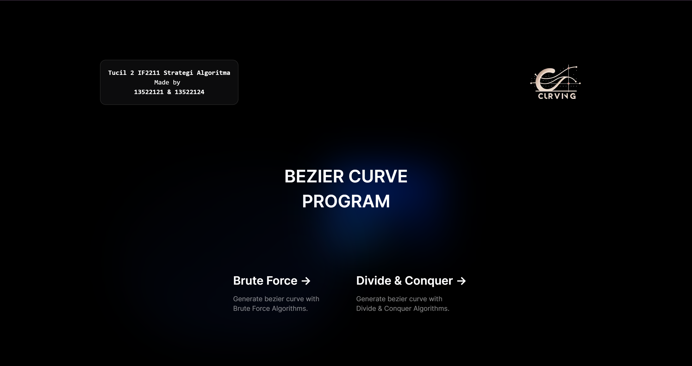
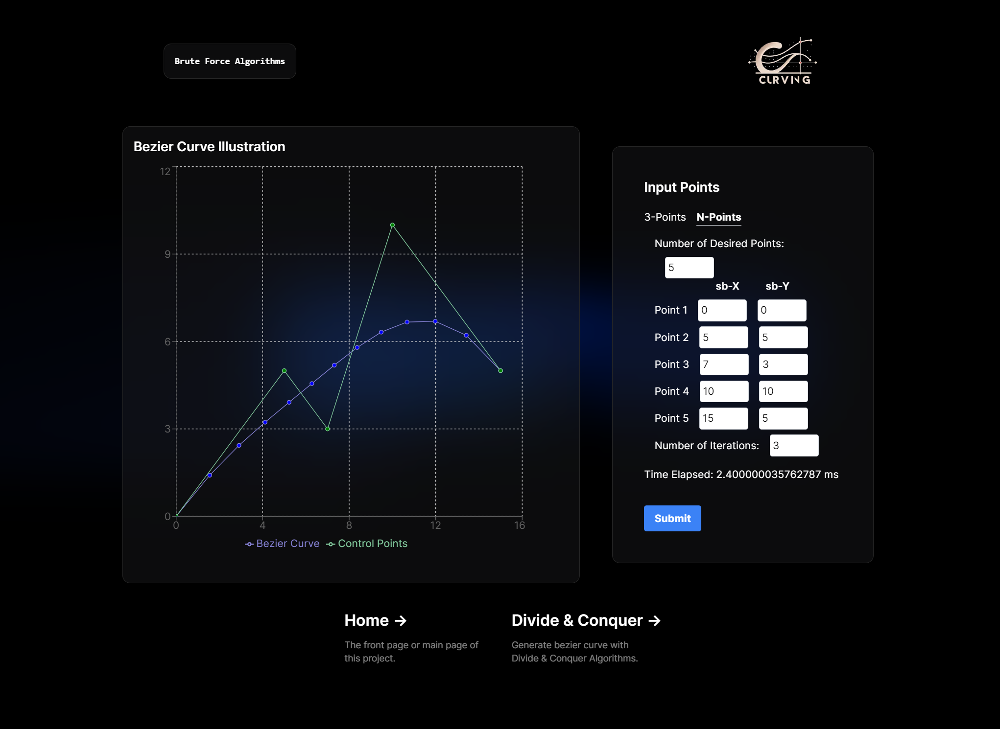
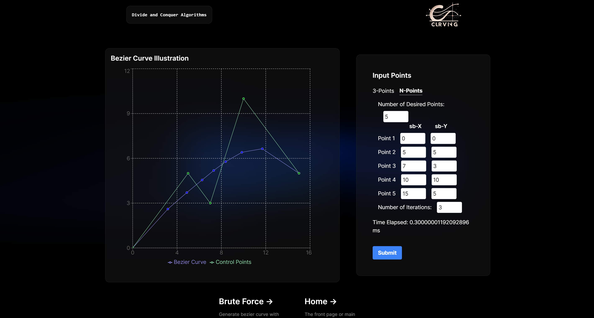

  

# 📉 Curving: Bezier Curve Program

> 🌐 Generate bezier curve program using divide and conquer algorithms with brute force algorithms as comparison

🎓 **Project Background:**
We created the bezier curve program website named "Curving" as part of my Algorithm Strategies assignment during my fourth semester in the Computer Science program at ITB.

## 🗒️ Description
In this project, we aim to demonstrate the efficiency of the divide and conquer algorithm over the brute force approach for generating Bézier curves. A Bézier curve is formed using a set of control points, where the shape and direction of the curve are determined by these points. Initially, the algorithm begins with a simple curve using a few control points and iteratively refines the curve by adding more points. The divide and conquer method splits the curve at midpoints, creating new segments that are progressively refined through successive iterations. This approach is contrasted with the brute force method, which calculates the curve's position at regular intervals directly from the control points. Our project focuses on comparing these two methodologies in terms of computational efficiency, particularly when dealing with a high number of control points, to demonstrate that the divide and conquer algorithm is more effective for creating smoother and more accurate Bézier curves.

## 🪪 Contributors
| Name | ID |
|---|---|
| Jonathan Emmanuel Saragih | 13522121 |
| Aland Mulia Pratama | 13522124 |

## 🪛 Configuration Guide
1. Clone the repository to your local files. Access the repository [here](repository-link).
2. Open the terminal and ensure that the directory is set to `Tucil2_13522121_13522124`.
3. Run `npm install` to activate the React-JS framework locally.
4. Execute `npm install recharts` to enable visualization chart to the website by using map data type.

## 🏃‍♂️ How to Run
1. Change the terminal directory to `Tucil2_13522121_13522124/src`.
2. Execute `npm run dev` or you can also execute `npm run start`.
3. Navigate to the brute-force page or div-n-conquer via the website's `Navigation Bar` and input the points and also the iterations using the `input` form.
4. Alternatively, you can input more than 3 control points by using the `3 points & n points` toggle button in the `input` form.
5. Once you click submit button you can see the bezier curve illustration at the `Bezier Curve Illustration` container.

## 📸 Screenshots

  
  
<i>Home Page</i>

  
  
<i>Brute Force Page</i>

  
  
<i>Divide and Conquer Page</i>

